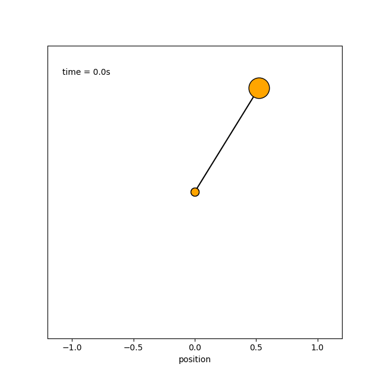

# Numerical simulation of a Pendulum

Forward Euler Simulation of a pendulum. 

Equation of motion:

$$
\ddot \theta = \frac{g}{l}\sin(\theta)
$$

Simulation with the following initial conditions: [0.55, 0, 0]

    

    

