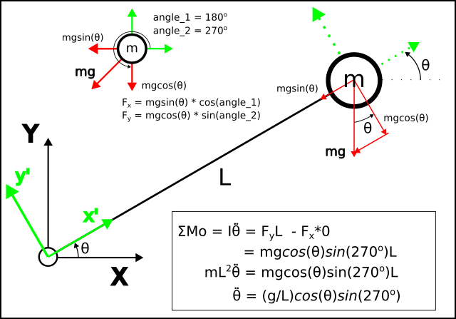

# Numerical simulation of a Pendulum

Forward Euler Simulation of a pendulum. 

Deriving the equation of motion:

    

$$
\ddot \theta = \frac{g}{l}\cos(\theta)\sin(\frac{3}{2}\pi)
$$

Which is

$$
\ddot \theta = -\frac{g}{l}\cos(\theta)
$$

Simulation with the following initial conditions: [0.55, 0, 0]

    

    

